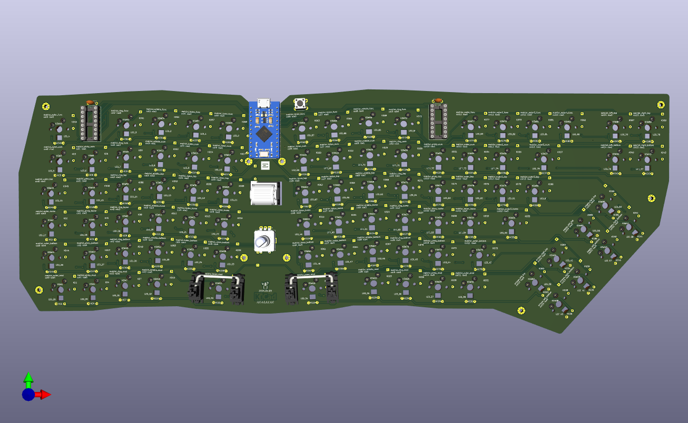
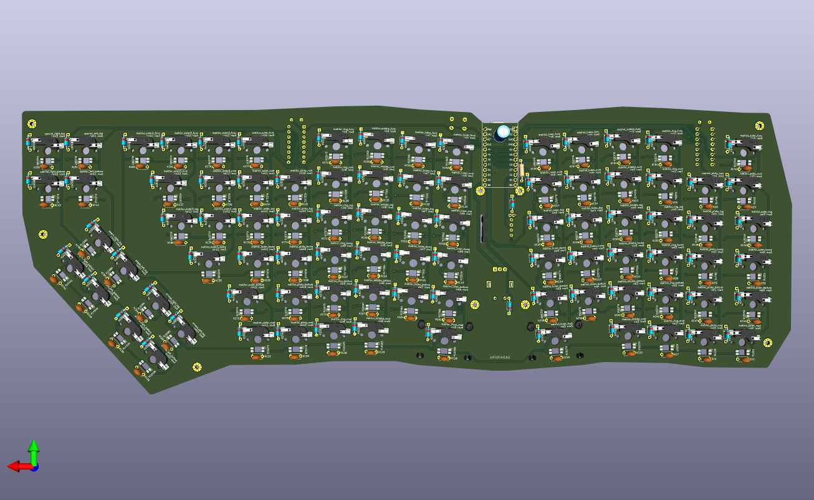
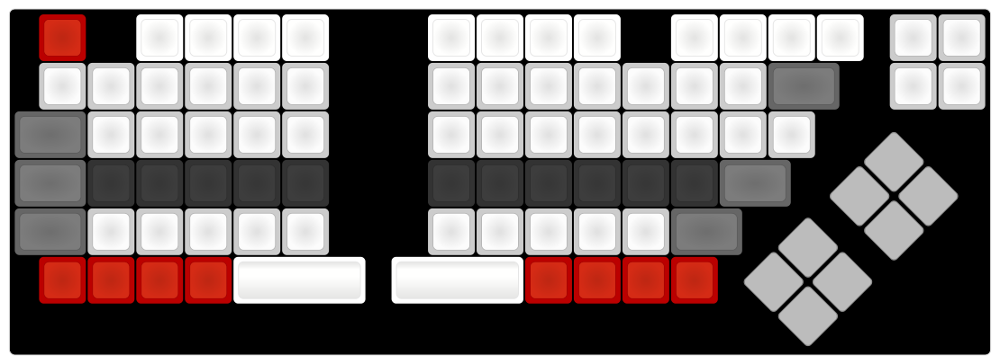

# Travis's Ergogen Keyboard 2024 #
Built with Ergogen v4. *Alpha* quality!

## Project Details ##
* `/config.yaml`
* `/package.json` yarn commands and metadata
* `/output/outlines/` generated 2d models
* `/output/cases/` generated 3d models
* `/output/pcbs/` generated PCB
* `/footprints/travis/` Custom parts' footprints
    * `/footprints/travis/travis.pretty/` KiCad footprints
* `/key/` generator for individual key footprint (key-module.js)
    * `/keytest/` test for individual key footprint
* `/datasheets/` PDFs for some of the parts used
* `/kle/` keyboard-layout-editor.com layouts
* `/firmware/` qmk firmware compiles, but needs to be tested!

## References ##
* Ergogen project: https://github.com/ergogen/ergogen/
    * https://ergogen.cache.works/
    * https://ergogen.xyz/
* FlatFootFox's Let's Design A Keyboard With Ergogen v4 https://flatfootfox.com/ergogen-introduction/
* Footprints:
    * ceoloide's Ergogen PCB footprints https://github.com/ceoloide/ergogen-footprints
    * infused-kim's Ergogen PCB footprints https://github.com/infused-kim/kb_ergogen_fp/
    * TildeWill's Ergogen PCB footprints https://github.com/TildeWill/ergogen_footprints
    * MvEerd https://github.com/MvEerd/ergogen/tree/mveerd/src/footprints
    * daprice's keyswitches.pretty https://github.com/daprice/keyswitches.pretty
    * joe-scotto's scottokeebs: https://github.com/joe-scotto/scottokeebs/tree/main/Extras/ScottoKicad
    * Convert Kicad Footprints to Ergogen https://nilnil.notion.site/Convert-Kicad-Footprints-to-Ergogen-8340ce87ad554c69af4e3f92bc9a0898
    * KiCad Footprints: https://kicad.github.io/footprints/
* Other helpful build guides:
    * ceoloide's corney-island build https://github.com/ceoloide/corney-island
    * Kimiko Build Guide https://keycapsss.com/help/kimiko/buildguide_en
    * Nullbits Nibble https://github.com/nullbitsco/docs/blob/main/nibble/build_guide_en.md
    * Lagom https://github.com/mohoyt/lagom/
    * Sundown-keyboard https://github.com/Richiban/Sundown-keyboard/
    * Mantis hex ergo keyboard https://github.com/fxkuehl/mantis/
    * Sofle Keyboard https://github.com/josefadamcik/SofleKeyboard

## Parts ##

Aliexpress:
* Diodes: DO-35 1N4148 100pcs https://www.aliexpress.us/item/3256805608834808.html
* Rotary encoder: EC11 12.5mm 5pcs https://www.aliexpress.us/item/2251832789732148.html
* EVQWGD001 Encoder: https://www.aliexpress.us/item/3256806010310254.html
* IC SN74HC138N 10pcs https://www.aliexpress.us/item/3256806021872320.html
* RGB LEDs: SK6812 MINI-E 100pcs https://www.aliexpress.us/item/2255800289371100.html
* Capacitors: 104(0.1uF) 100pcs https://www.aliexpress.us/item/3256802104127109.html
* Resistor: 470R 100pcs https://www.aliexpress.us/item/3256801441680644.html
* Electrolytic Capacitor: 6.3V1000UF 6x11mm 10pcs https://www.aliexpress.us/item/3256802796040934.html

Adafruit:
* Adafruit KB2040 - RP2040 Kee Boar Driver https://www.adafruit.com/product/5302
* 5 @ Kailh Switch Sockets for MX-compatible Mechanical Keys - 20 Pack https://www.adafruit.com/product/4958
* 10 @ Kailh Mechanical Key Switches - Tactile Brown - 10 pack - Cherry MX Brown Compatible https://www.adafruit.com/product/4954
* 10 @ DSA Keycaps for MX Compatible Switches - 10 pack https://www.adafruit.com/product/5008
* USB A to USB C Cable - 2 meters long https://www.adafruit.com/product/5044